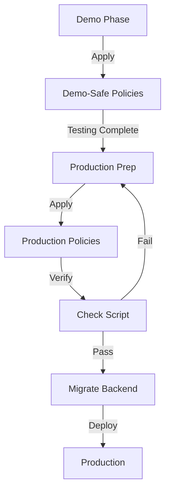

# Supabase RLS Scripts

This folder contains SQL scripts for managing Row Level Security (RLS) policies in your Supabase database.

## 📁 Files

### `production-rls-policies.sql`
**Purpose:** Apply production-grade RLS policies with strict user isolation

**When to use:** After demo/testing phase, before production launch

**What it does:**
- Drops demo-safe policies (`allow_*`)
- Creates production policies using `auth.uid()` checks
- Enforces user can only read/write their own data
- Applies to both `players` and `pending_actions` tables

**How to use:**
1. Open Supabase Dashboard → SQL Editor
2. Copy/paste entire file
3. Click "Run"
4. Verify with `check-production-rls.sql`

---

### `check-production-rls.sql`
**Purpose:** Verify RLS policies are correctly configured

**When to use:** After applying any RLS policy changes

**What it does:**
- Checks if RLS is enabled on tables
- Lists all policies with details
- Counts policies per table
- Identifies missing or unexpected policies
- Provides status report

**How to use:**
1. Open Supabase Dashboard → SQL Editor
2. Copy/paste entire file
3. Click "Run"
4. Review output for ✅/⚠️/❌ status

**Expected output (production):**
- RLS Enabled: true (both tables)
- 8 production policies total
- 0 demo policies remaining

---

### `fix-supabase-rls.sql` (if exists)
**Purpose:** Quick fix for demo-safe RLS policies

**When to use:** Emergency fix during demo/testing

**What it does:**
- Drops broken policies
- Creates permissive demo-safe policies
- Adds performance indexes

⚠️ **Not for production use** - too permissive

---

## 🚀 Quick Start

### For Demo/Testing (Current State)
Your demo-safe policies are already applied. No action needed.

### For Production Hardening

1. **Apply production policies**
   ```sql
   -- Run: scripts/production-rls-policies.sql
   ```

2. **Verify**
   ```sql
   -- Run: scripts/check-production-rls.sql
   ```

3. **Migrate backend**
   - See: `docs/BACKEND-SERVER-SIDE-PATTERNS.md`
   - See: `docs/PRODUCTION-RLS-MIGRATION.md`

## 📊 Policy Comparison

| Feature | Demo-Safe Policies | Production Policies |
|---------|-------------------|---------------------|
| **User reads own data** | ✅ Yes | ✅ Yes |
| **User reads others' data** | ✅ Yes (all) | ⚠️ Limited (leaderboards only) |
| **User updates own data** | ✅ Yes | ✅ Yes |
| **User updates others' data** | ⚠️ Yes (UNSAFE!) | ❌ No |
| **Client-side writes** | ✅ Allowed | ⚠️ Limited |
| **Server-side writes** | ✅ Allowed | ✅ Allowed (service_role) |
| **Hard deletes** | ❌ Blocked | ❌ Blocked |
| **User isolation** | ❌ None | ✅ Strict |

## 🔒 Security Levels

### 🟡 Demo-Safe (Current)
- **Risk:** Any user can modify other users' data
- **Use case:** Rapid prototyping, demos, testing
- **Policy prefix:** `allow_*`

### 🟢 Production (Target)
- **Risk:** Minimal (strict user isolation)
- **Use case:** Production deployment
- **Policy prefix:** `production_*`

## 🆘 Troubleshooting

### Error: "policy already exists"
**Solution:** Run the DROP statements first
```sql
DROP POLICY IF EXISTS "policy_name" ON public.table_name;
```

### Error: "new row violates row-level security"
**Cause:** RLS enabled but no policies allow the operation

**Solution:** Check if correct policies are applied
```sql
-- Run: scripts/check-production-rls.sql
```

### Users can't read their own data
**Cause:** Policy USING clause too restrictive

**Check:** Verify `auth.uid()` matches `user_id` column
```sql
SELECT auth.uid(), user_id FROM players WHERE user_id = auth.uid();
```

## 📚 Related Documentation

- `SUPABASE-RLS-FIX.md` - Emergency fix guide (root)
- `docs/PRODUCTION-RLS-MIGRATION.md` - Step-by-step migration
- `docs/BACKEND-SERVER-SIDE-PATTERNS.md` - API route examples

## 🔄 Workflow



## ⚡ Quick Commands

### List current policies
```sql
SELECT tablename, policyname, cmd 
FROM pg_policies 
WHERE tablename IN ('players', 'pending_actions')
ORDER BY tablename, cmd;
```

### Check RLS status
```sql
SELECT tablename, rowsecurity 
FROM pg_tables 
WHERE schemaname = 'public' 
  AND tablename IN ('players', 'pending_actions');
```

### Count policies
```sql
SELECT tablename, COUNT(*) as policy_count
FROM pg_policies
WHERE tablename IN ('players', 'pending_actions')
GROUP BY tablename;
```
